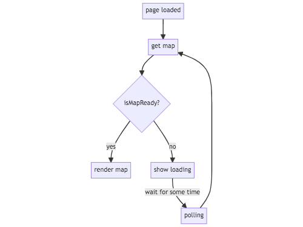
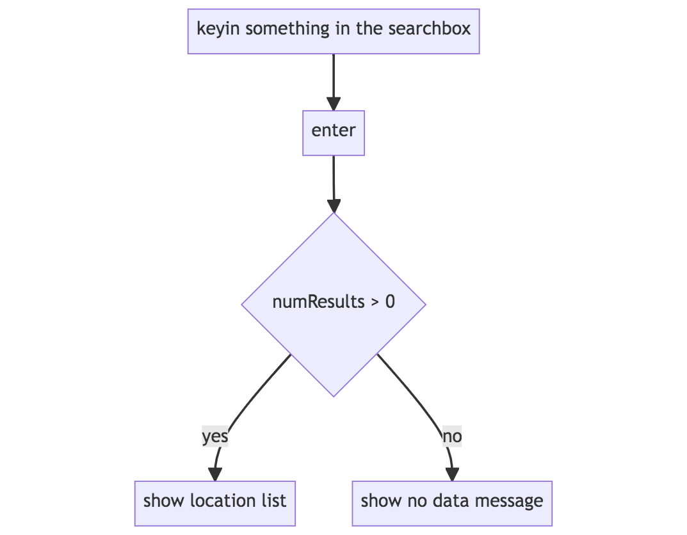
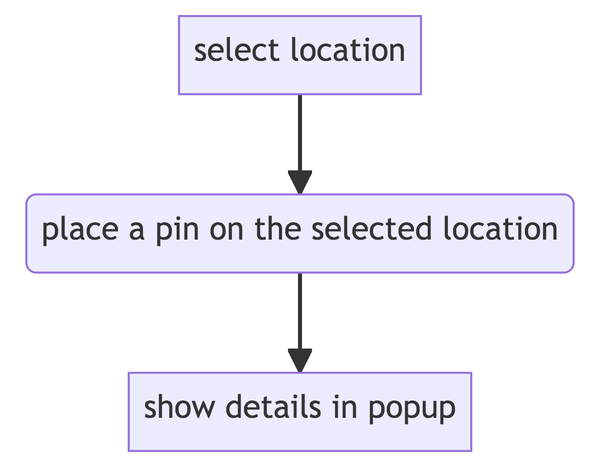
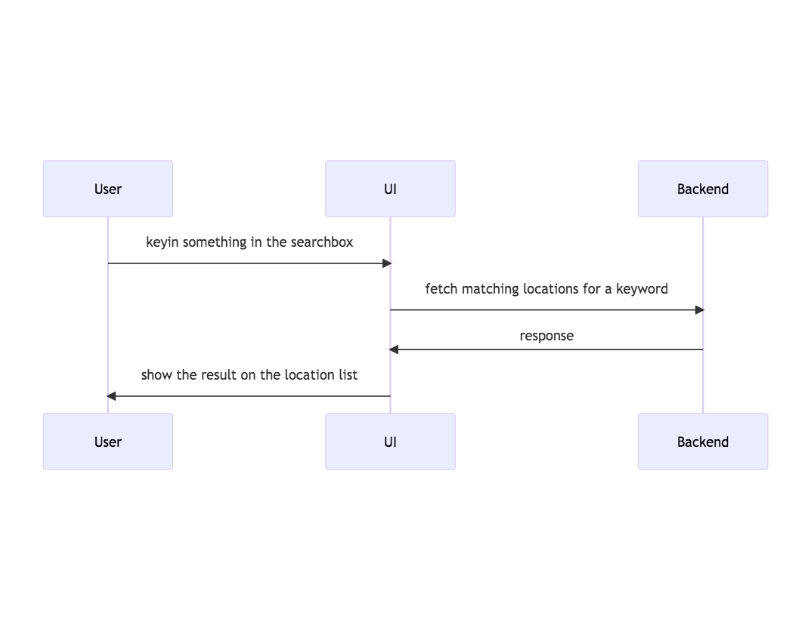

# Azure Maps Demo

## Setup

- Clone this project.
- Install dependencies by using yarn.

### Available Scripts

- `yarn start` for local development.
- `yarn test` for unit testing.
- `yarn lint:fix` for the linter.

## UI Flow

Initialize the map rendering.



Perform a keyword search to retrieve matching locations.



Place a pin on the selected location on the map.



## API Integration

API: GET `https://atlas.microsoft.com/search/poi/json`



### Request

parameters
- api-version: we are using 1.0
- subscription-key: primary key
- query: keyword to be searched
- lat: latitude
- lon: longitude

### Response

Status Code: 200.

Sample respnse.

```json
{
  "summary": {
    "query": "pizza",
    "queryType": "NON_NEAR",
    "queryTime": 208,
    "numResults": 1,
    "offset": 0,
    "totalResults": 1,
    "fuzzyLevel": 1,
    "geoBias": {
      "lat": 40.712784779958255,
      "lon": -74.00600910186768
    },
    "geobiasCountry": "US"
  },
  "results": [
    {
      "type": "POI",
      "id": "pJ1zEeyKSadBY26PyZ3OoQ",
      "score": 0.9868913293,
      "dist": 207.361534,
      "info": "search:ta:840369010448932-US",
      "matchConfidence": {
        "score": 1
      },
      "poi": {
        "name": "Famous Original Ray's Pizza",
        "phone": "+1 800-675-8735",
        "categorySet": [
          {
            "id": 7315036
          }
        ],
        "url": "www.rayspizza.com",
        "categories": [
          "pizza",
          "restaurant"
        ],
        "classifications": [
          {
            "code": "RESTAURANT",
            "names": [
              {
                "nameLocale": "en-US",
                "name": "restaurant"
              },
              {
                "nameLocale": "en-US",
                "name": "pizza"
              }
            ]
          }
        ]
      },
      "address": {
        "streetNumber": "123",
        "streetName": "Nassau Street",
        "municipalitySubdivision": "曼哈頓",
        "municipality": "紐約",
        "countrySecondarySubdivision": "New York",
        "countrySubdivision": "NY",
        "countrySubdivisionName": "紐約",
        "postalCode": "10038",
        "extendedPostalCode": "10038-2415",
        "countryCode": "US",
        "country": "美國",
        "countryCodeISO3": "USA",
        "freeformAddress": "123 Nassau Street, New York, NY 10038",
        "localName": "New York"
      },
      "position": {
        "lat": 40.711046,
        "lon": -74.006898
      },
      "viewport": {
        "topLeftPoint": {
          "lat": 40.71195,
          "lon": -74.00808
        },
        "btmRightPoint": {
          "lat": 40.71015,
          "lon": -74.00571
        }
      },
      "entryPoints": [
        {
          "type": "main",
          "position": {
            "lat": 40.71098,
            "lon": -74.00682
          }
        }
      ]
    }
  ]
}
```

## References

- [Azure Maps Documentation - Quickstart: Create an interactive search map with Azure Maps](https://learn.microsoft.com/en-us/azure/azure-maps/quick-demo-map-app)
- [React Azure Maps](https://react-azure-maps.vercel.app/)
- [react-azure-maps-playground](https://github.com/Azure/react-azure-maps-playground)
